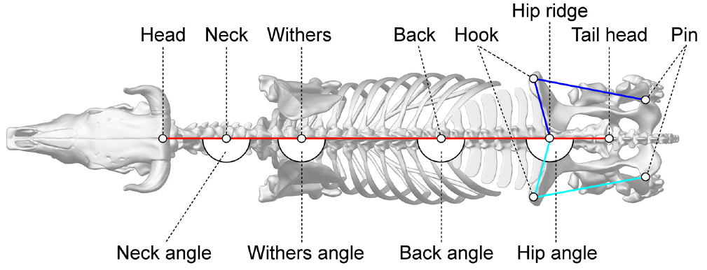

# Sistema Híbrido de Visão Computacional para Identificação Individual Bovina

## 1. Resumo
Este documento detalha o desenvolvimento de um pipeline capaz de identificar vacas individualmente. O sistema utiliza uma abordagem de duas etapas: primeiro, a localização de Keypoints que formam a estrutura anatômica dos bovinos via **Deep Learning**, seguido por uma análise de **Geometria Computacional** e **Aprendizado Supervisionado** para o reconhecimento individual das vacas.

---

## 2. Fase 1: Estimativa de Pose (Notebook 03)
A primeira etapa utiliza o modelo **YOLOv8-Pose**. O objetivo aqui não é apenas detectar a vaca, mas extrair sua "assinatura estrutural".

* **Configuração do Modelo:** Foi utilizado o modelo `yolov8n-pose.pt` (versão Nano), otimizado para ambientes com restrição de hardware.
* **Anotações Anatômicas:** O modelo foi treinado para identificar 8 pontos-chave fundamentais para a biometria bovina. Abaixo, correlacionamos os termos em português com as marcações em inglês presentes na imagem de referência:
    1. **Cernelha** (*Withers*)
    2. **Dorso** (*Back*)
    3. **Lombo** (*Loin*)
    4. **Garupa/Anca** (*Hip/Hook*)
    5. **Ponta do Ísquio** (*Pin Bone*)
    6. **Inserção da Cauda** (*Tailhead*)
    *Nota: Os pontos de Hooks e Pins são extraídos em suas vistas superiores (Up/Down) para permitir o cálculo de larguras pélvicas.*

> 
> *Figura 1: Mapeamento de Keypoints utilizados para extração de features geométricas.*
* **Performance da detecção de Keypoints:** O treinamento atingiu alta precisão na localização dos Keypoints, validada pela métrica *Object Keypoint Similarity* (OKS). Conforme os logs de validação final (Notebook 03), os resultados consolidados foram:
    * **mAP50 (Pose):** **0.992** (Indica que em 99,2% das detecções, o esqueleto foi identificado corretamente dentro de uma margem padrão).
    * **mAP50-95 (Pose):** **0.881** (Métrica rigorosa que atesta a precisão média em múltiplos níveis de exigência; um valor de 88% é considerado excelente para aplicações biométricas em gado).
    * **Precision/Recall (Pose):** Estabilizados em **0.986** e **0.993**, respectivamente, garantindo que o modelo é extremamente confiável, sem gerar falsas detecções de pontos inexistentes.
    * **Box Precision/Recall:** A detecção do corpo do animal (Bounding Box) também apresentou performance superior, com **mAP50 de 0.994** e **mAP50-95 de 0.82**.

---

## 3. Fase 2: Engenharia de Atributos Biométricos (Notebook 04)
Nesta etapa, transformamos os dados brutos de pixels e coordenadas $(x, y)$ em um vetor de características (*feature vector*) invariante a fatores externos como zoom e rotação da câmera.

### 3.1. Biometria Geométrica e Morfometria
A análise geométrica traduz a estrutura física do animal em métricas numéricas. Para garantir que o sistema identifique a mesma vaca independentemente da sua distância em relação à lente, aplicamos uma **Normalização por Escala Relativa**, utilizando o comprimento do dorso (distância entre *Withers* e *Tailhead*) como unidade de medida base.

* **Cálculo de Angulação Óssea:** Utilizamos o conceito de álgebra linear para extrair ângulos entre os marcos anatômicos. Dado um vértice (ex: *Hip/Hook*), definimos dois vetores $\mathbf{u}$ e $\mathbf{v}$ apontando para os pontos adjacentes. O ângulo $\theta$ é extraído pelo produto escalar:

    $$\theta = \cos^{-1} \left( \frac{\mathbf{u} \cdot \mathbf{v}}{\|\mathbf{u}\| \|\mathbf{v}\|} \right)$$

    *Aplicação:* Identificar a inclinação da garupa e a angulação do jarrete, características únicas de cada indivíduo.

* **Áreas Poligonais (Fórmula de Shoelace):** Para capturar a massa corporal e proporções pélvicas, calculamos a área de polígonos convexos formados pelos pontos *Hook*, *Pin* e *Tailhead*. A área $A$ é obtida por:

    $$A = \frac{1}{2} | \sum_{i=1}^{n-1} (x_i y_{i+1} - x_{i+1} y_i) |$$

### 3.2. Descritores de Aparência e Textura
Para complementar a geometria (que descreve o "esqueleto"), o sistema utiliza descritores clássicos de visão computacional para descrever a "superfície" (pelagem e musculatura).

* **Local Binary Patterns (LBP):** O LBP é utilizado para extrair a textura da pelagem. O algoritmo compara cada pixel com sua vizinhança, gerando um código binário que descreve micro-padrões (bordas, manchas, rugosidade). No projeto, geramos um **Histograma LBP**, que serve como uma assinatura estatística da distribuição de texturas na imagem, sendo altamente resistente a variações de iluminação.

* **Histogram of Oriented Gradients (HOG):** Enquanto o LBP foca na textura fina, o HOG foca na estrutura de forma e contorno. Ele calcula a distribuição das orientações dos gradientes de intensidade (mudanças de cor) em partes localizadas da imagem. 
    * **Funcionamento:** A imagem é dividida em pequenas células, e para cada célula é computado um histograma de direções de gradiente. Isso captura o "formato" dos músculos e a curvatura do animal, sendo um descritor poderoso para distinguir silhuetas muito similares.

### 3.3. Fusão Híbrida de Dados
O diferencial desta fase é a **Concatenação de Features**. O vetor final alimentado nos modelos (MLP e Siamesas) é a união de:
1.  **Vetor Geométrico:** Proporções e ângulos (35 colunas).
2.  **Vetor HOG/LBP:** Descritores estatísticos de aparência.

Esta abordagem híbrida permite que o modelo aprenda que a "Vaca A" não é apenas um conjunto de ângulos pélvicos, mas também possui um padrão de gradiente de pelagem específico na região do lombo.

---

## 4. Fase 3: Modelagem e Reconhecimento (Notebooks 05 e 06)
Com os dados extraídos, foram testadas duas arquiteturas de ponta para a identificação:

### 4.1. Perceptron Multicamadas (MLP)
Uma rede neural densa foi treinada para classificar cada vetor de características em uma das identidades conhecidas.
* **Resultados:** No Cenário Híbrido (Geometria + LBP), o modelo alcançou **98% de acurácia** no conjunto de teste para as classes avaliadas, demonstrando que a união de "forma" e "textura" é superior a qualquer uma das métricas isoladas.

### 4.2. Redes Siamesas (Deep Metric Learning)
O Notebook 06 implementa uma abordagem baseada em **Similaridade**. Em vez de classificar, a rede aprende a "distância" entre duas vacas.
* **Vantagem:** Permite identificar se uma vaca é nova no sistema sem precisar retreinar todo o modelo (sistema Open-Set).
* **Função de Perda:** Utiliza similaridade de cosseno para agrupar instâncias da mesma vaca no espaço latente.

---

## 5. Resultados e Conclusão
Os experimentos demonstram que a identificação bovina por keypoints é altamente eficaz. O uso de modelos leves como YOLOv8n e MLPs estruturadas permitiu processamento em tempo real com alta confiabilidade.

**Destaques do Projeto:**
1.  Invariância a escala e rotação através de geometria.
2.  Alta acurácia (98%) com dados híbridos.
3.  Pipeline modularizado, facilitando a substituição de componentes no futuro.